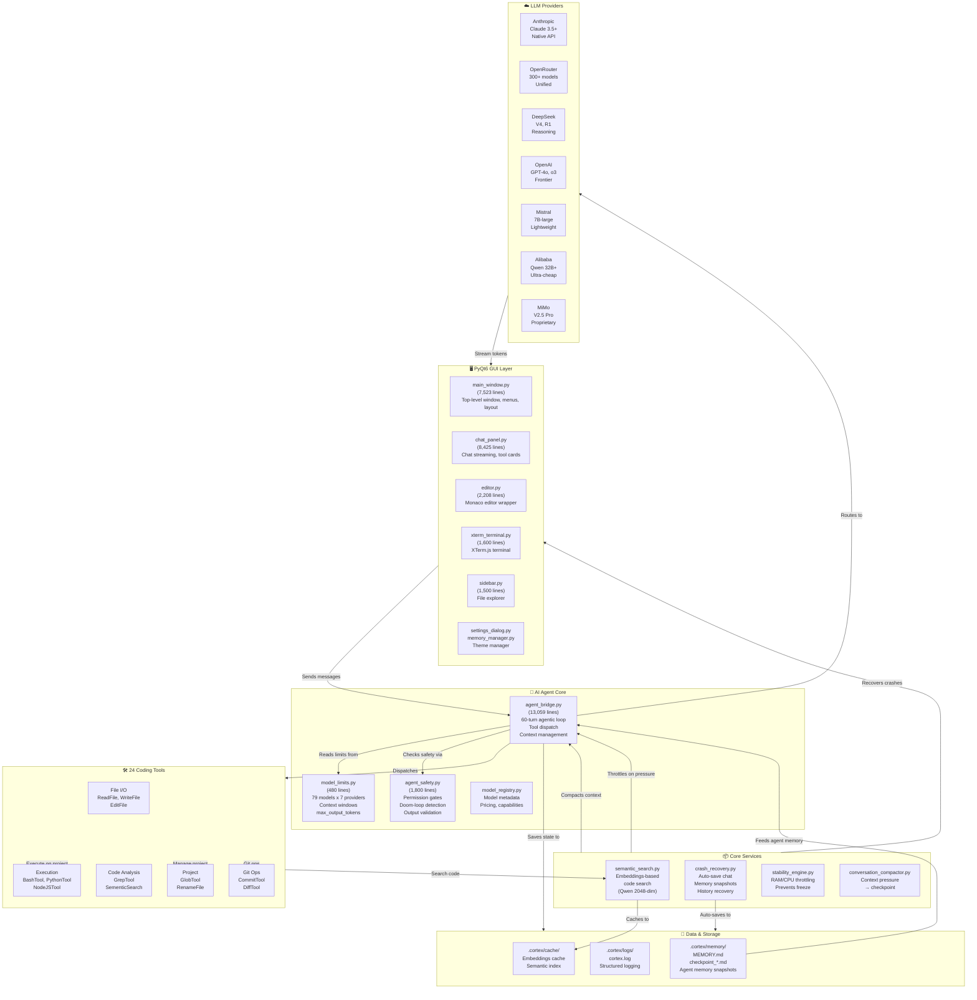
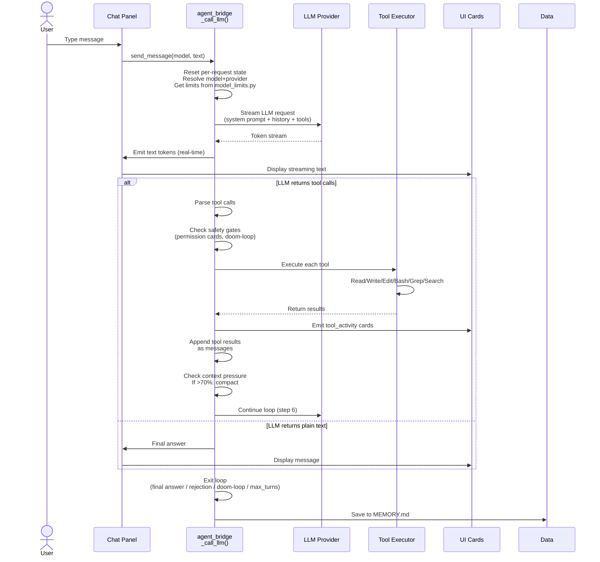
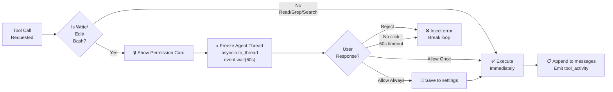
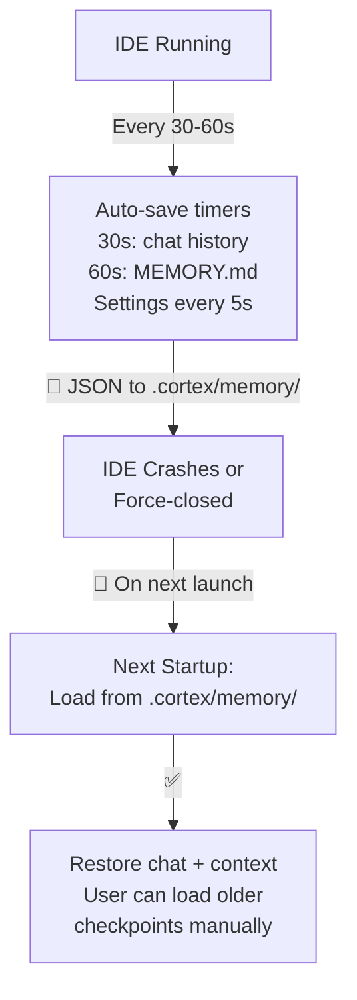

# Cortex AI IDE — Visual Architecture

## System Architecture Diagram



---

## Data Flow — User Message to Agent Response



---

## Agentic Loop State Machine

```mermaid
stateDiagram-v2
    [*] --> ResetState: _call_llm() entry
    ResetState --> ResolveLLM: Get model+provider
    ResolveLLM --> GetLimits: Load from model_limits.py
    GetLimits --> TurnLoop: for turn in range(max_turns)
    
    TurnLoop --> CheckStability: Check RAM/CPU
    CheckStability -->|HIGH/CRITICAL| Throttle: Sleep 2.5-8s\nMicro-compact
    Throttle --> StreamLLM
    CheckStability -->|Normal| StreamLLM
    
    StreamLLM --> StreamLLM: Accumulate tokens\nParse tool deltas
    StreamLLM --> HasTools{Tool calls?}
    
    HasTools -->|No| FinalAnswer: Return text
    HasTools -->|Yes| CheckSafety: Permission gates\nDoom-loop check
    
    CheckSafety -->|Blocked| Break: Inject error\nBreak loop
    CheckSafety -->|OK| ExecuteTools: Dispatch tools
    
    ExecuteTools --> ExecuteTools: Read/Write/Edit/Bash/Grep\nEmit tool_activity cards
    ExecuteTools --> AppendResults: Add to messages
    
    AppendResults --> CheckPressure: Context >70%?
    CheckPressure -->|Yes| Compact: Auto-compact\n→ checkpoint
    CheckPressure -->|No| ContinueLoop
    Compact --> ContinueLoop
    
    ContinueLoop --> TurnLoop: Continue turn loop
    TurnLoop --> MaxTurns{max_turns\nexhausted?}
    
    MaxTurns -->|Yes| AutoContinue: If todos pending:\nauto-continue cycle
    MaxTurns -->|No| TurnLoop
    AutoContinue --> [*]
    
    FinalAnswer --> [*]
    Break --> [*]
```

---

## Project File Organization

```
cortex_desktop/
├── src/                              (637 Python files, ~180K lines)
│
├── src/ai/                           LLM Agent + Tool Execution
│   ├── agent_bridge.py               (13,059 lines) ⭐ Core agentic loop
│   ├── agent_safety.py               (1,800 lines)  Safety gates
│   ├── model_limits.py               (480 lines)    79 models x 7 providers
│   ├── providers/                    (7 provider implementations)
│   │   ├── anthropic_provider.py
│   │   ├── openrouter_provider.py
│   │   ├── deepseek_provider.py
│   │   ├── openai_provider.py
│   │   ├── mistral_provider.py
│   │   ├── alibaba_provider.py
│   │   └── mimo_provider.py
│   └── tool_executor.py              Dispatcher for 24 tools
│
├── src/ui/                           PyQt6 GUI Components
│   ├── main_window.py                (7,523 lines)  Top-level window
│   ├── chat_panel.py                 (8,425 lines)  Chat UI + streaming
│   ├── components/
│   │   ├── editor.py                 (2,208 lines)  Monaco editor
│   │   ├── xterm_terminal.py         (1,600 lines)  Terminal
│   │   ├── sidebar.py                (1,500 lines)  File explorer
│   │   └── ...
│   └── themes/
│       ├── dark.qss
│       ├── light.qss
│       └── theme_manager.py
│
├── src/core/                         Business Logic
│   ├── semantic_search.py            Code search (embeddings)
│   ├── embeddings.py                 Embedding model support
│   ├── siliconflow_embeddings.py     SiliconFlow backend
│   ├── crash_recovery.py             Auto-save + recovery
│   ├── git_integration.py            Git operations
│   └── ...
│
├── src/agent/src/                    Agent Sub-module (100+ files)
│   ├── tools/                        24 coding tools
│   ├── coordinator/                  Multi-turn orchestration
│   ├── permissions/                  Permission gates
│   ├── services/                     Background workers
│   └── ...
│
├── tests/                            Test Suite
│   ├── test_release_suite.py         (38 tests)
│   └── ...
│
├── Docs/                             Architecture Documentation
│   ├── agent_loop/                   Agentic loop design
│   ├── AI_MODEL_REFERENCE.md         All 50+ models
│   ├── LIGHT_MODE_IMPLEMENTATION.md
│   └── ...
│
├── .cortex/                          Runtime Data
│   ├── memory/                       MEMORY.md + checkpoint_*.md
│   ├── logs/                         cortex.log
│   └── cache/                        Embeddings cache
│
└── requirements.txt                  Python dependencies (60+)
```

---

## Key File Sizes

| File | Lines | Purpose |
|------|-------|---------|
| `agent_bridge.py` | 13,059 | ⭐ Agentic loop core |
| `chat_panel.py` | 8,425 | Chat UI + streaming |
| `main_window.py` | 7,523 | Top-level GUI window |
| `editor.py` | 2,208 | Monaco editor wrapper |
| `xterm_terminal.py` | 1,600 | Terminal emulator |
| `sidebar.py` | 1,500 | File explorer |
| `pathValidation.py` | 1,404 | Path security |
| `agent_safety.py` | 1,800 | Safety gates |
| `semantic_search.py` | 1,300 | Embeddings search |

---

## Provider + Model Summary

| Provider | Count | Best For |
|----------|-------|----------|
| **Anthropic** | 5 | Best overall (Claude 3.5 Sonnet) |
| **OpenRouter** | 20+ | Diverse + cheap |
| **DeepSeek** | 4 | Cost-effective reasoning |
| **OpenAI** | 5 | Frontier models |
| **Mistral** | 3 | Lightweight |
| **Alibaba (Qwen)** | 4 | Ultra-cheap |
| **MiMo** | 2 | Proprietary alternative |
| **SiliconFlow** | 3 | Embedding models |

**Total: 50+ models registered, all with context window + token limits verified**

---

## Safety & Permission Gates



---

## Crash Recovery Flow



---

## How the Agent Thinks

1. **Reads user message** → adds to conversation
2. **Formats prompt** with system instructions + chat history + available tools
3. **Streams from LLM** with tool-calling enabled
4. **Parses response** in real-time (text tokens + tool deltas)
5. **For each tool call:**
   - Check safety gates (permission cards, doom-loop)
   - Execute the tool (read file, run bash, search, git push, etc.)
   - Get result
   - Append result as tool message
   - Emit UI card (Explore/File/Terminal card)
6. **Loop until:**
   - Final answer (plain text, no tool calls)
   - User rejects permission card
   - Doom-loop detected (same tool+args 5×)
   - max_turns reached (60 for 1M-ctx, 30 for 128K-ctx)
7. **Save to memory** (MEMORY.md + checkpoint files)

**Key property:** Agent is **frozen** during permission card — physically cannot bypass via alternative tool.
