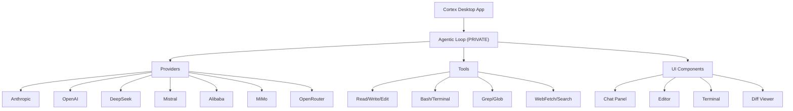

# Cortex AI IDE — Open-Source Components

<p align="center">
  
</p>

<p align="center">
  <strong>The Agentic IDE for Windows — Code at the speed of thought.</strong>
</p>

<p align="center">
  <a href="https://cortexide.ai">Website</a> ·
  <a href="https://docs.cortexide.ai">Docs</a> ·
  <a href="https://x.com/CortexIDE">Twitter/X</a>
</p>

---

## About

This repository contains the **open-source components** of [Cortex AI IDE](https://cortexide.ai), an agentic AI code editor for Windows. Cortex lets you hand off tasks to autonomous AI agents that plan, write code, run commands, and iterate.

The full Cortex IDE is a commercial product with additional features (agentic loop, safety gates, sandbox, auth, points system). This repo contains the parts we've open-sourced for the community.

## What's Inside

| Component | Description |
|-----------|-------------|
| `src/ui/` | Full Qt-based UI: chat panel, editor, sidebar, terminal, diff viewer, permission cards, live preview |
| `src/ai/providers/` | LLM provider integrations: Anthropic, OpenAI, DeepSeek, Mistral, Alibaba, MiMo, OpenRouter, SiliconFlow |
| `src/ai/model_limits.py` | Model definitions, token limits, and capabilities for 50+ models |
| `src/ai/model_registry.py` | Model registry and routing logic |
| `src/ai/tool_executor.py` | Tool execution engine (Read, Write, Edit, Bash, Grep, Glob, WebFetch, WebSearch) |
| `src/core/embeddings.py` | Semantic embeddings for code search |
| `src/core/semantic_search.py` | Natural language code search |
| `src/core/code_chunker.py` | Code chunking for semantic indexing |
| `src/utils/` | Utilities: diff algorithm, git helpers, language detection, logger, notifications, icons |
| `src/services/` | MCP manager, usage tracker, update checker |
| `src/plugin/` | Plugin system for extending Cortex |
| `src/coordinator/` | Multi-agent coordinator system |
| `plugins/` | Bundled plugins |
| `Docs/` | Technical documentation, audits, architecture docs |
| `tests/` | Test suite |

## What's NOT Included (Private)

The following is **only available in the full commercial version**:

- **Agentic Loop** (`agent_bridge.py`) — The core autonomous agent orchestration
- **Safety Gates** (`agent_safety.py`) — Permission systems and destructive operation guards
- **Security** — Auth manager, key manager, credential storage, secure transmission
- **Sandbox** — Isolated code execution environment
- **Points/Pricing** — Commercial licensing system
- **Build System** — Installer configs, PyInstaller specs
- **Full App** — `main_window.py`, `main.py` application entry points

## Architecture



## Getting Started

This repo is not a standalone application. It's a component library meant to be integrated into or referenced by other projects.

### Requirements

- Python 3.11+
- PyQt6
- See `requirements.txt` for full dependencies

### Installation

```bash
git clone https://github.com/CortexIDE/cortex-oss.git
cd cortex-oss
pip install -r requirements.txt
```

### Private Stubs

Some public modules reference private (commercial) components. If you encounter import errors, install the stub package:

```bash
pip install -e .
```

The stubs provide interface definitions without the proprietary implementation.

## License

This project is licensed under the **Apache License 2.0** — see [LICENSE](LICENSE) for details.

The Apache 2.0 license allows:
- ✅ Commercial use
- ✅ Modification
- ✅ Distribution
- ✅ Patent use
- ✅ Private use

With requirements for:
- 📄 License and copyright notice
- 📝 State changes made
- ™️ No trademark use without permission

## Contributing

We welcome contributions! See [CONTRIBUTING.md](CONTRIBUTING.md) for guidelines.

1. Fork the repository
2. Create a feature branch (`git checkout -b feature/amazing-feature`)
3. Commit your changes (`git commit -m 'Add amazing feature'`)
4. Push to the branch (`git push origin feature/amazing-feature`)
5. Open a Pull Request

## Community

- [Website](https://cortexide.ai) — Download the full Cortex IDE
- [Documentation](https://docs.cortexide.ai) — User and developer docs
- [Twitter/X](https://x.com/CortexIDE) — Updates and announcements

---

**Cortex AI IDE** — Think Limitless. Build Beyond.
