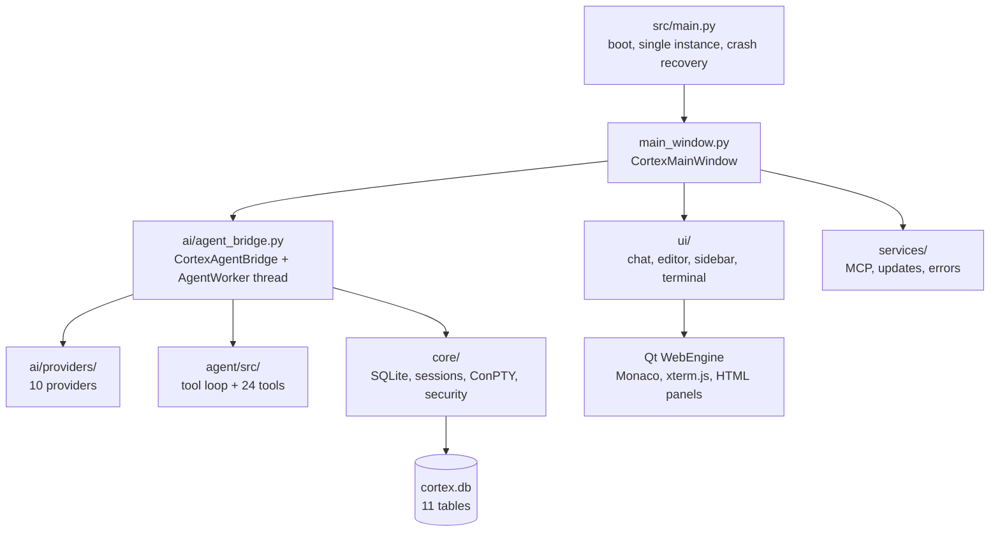

<div align="center">

# Cortex AI IDE

### The agentic IDE for Windows

Hand a task to an AI agent and watch it plan, read your code, edit files, run
commands and iterate until the work is done, inside a real IDE.

**Version 3.0.41** &nbsp;·&nbsp; Apache-2.0 &nbsp;·&nbsp; Windows 10 / 11

[Website](https://cortexide.ai) &nbsp;·&nbsp; [Documentation](https://docs.cortexide.ai) &nbsp;·&nbsp; [Issues](https://github.com/Cortex-AI-IDE/Cortex-Desktop/issues)

</div>

---

## Contents

- [What Cortex is](#what-cortex-is)
- [Licence and scope](#licence-and-scope)
- [Requirements](#requirements)
- [Installation](#installation)
- [Why Node.js is required](#why-nodejs-is-required)
- [First run and API keys](#first-run-and-api-keys)
- [Project layout](#project-layout)
- [Architecture](#architecture)
- [Agent tools](#agent-tools)
- [Supported model providers](#supported-model-providers)
- [Troubleshooting](#troubleshooting)
- [Development](#development)
- [Licence](#licence)
- [Contributing](#contributing)

---

## What Cortex is

Cortex is a desktop code editor built around an autonomous agent rather than a
chat sidebar bolted onto an editor. The agent has its own tool loop: it can
search the project, read files, write and edit them, run shell commands in a
real terminal, fetch web pages, and check its own work with a verification
pass. You watch each step land in the transcript as it happens.

The application is a hybrid: a native PyQt6 shell for the window, splitters,
dialogs and process management, with Chromium (Qt WebEngine) hosting four rich
panels that would be painful to build natively:

| Panel | Technology |
|-------|------------|
| File explorer | `src/ui/html/sidebar.html` |
| Editor | Monaco Editor in `src/assets/editor.html` |
| Terminal | xterm.js in `src/ui/components/assets/xterm` |
| Chat transcript, memory manager, live preview | `src/ui/html/ai_chat`, `src/ui/html/memory_manager` |

### What it does

- **Agentic editing.** The agent works through a task with tools, not just
  suggestions. Every file write is shown as a reviewable diff.
- **Permission gates.** Destructive operations are gated before they run, with
  a rule system (exact match, wildcard) for the commands you trust.
- **Verified iteration.** A loop engine can run your tests, lint and build,
  then feed the failures back to the model until the checks pass.
- **Bring your own key.** Ten providers are supported natively. Keys are stored
  encrypted on your machine and never leave it except to the provider you chose.
- **Project memory.** Markdown memories in `~/.cortex/memory` carry decisions
  and preferences across sessions.
- **MCP support.** External Model Context Protocol servers load into the same
  tool loop.
- **Bundled skills.** PDF, Word, Excel, PowerPoint, test-driven development,
  browser testing and more, loaded on demand.

---

## Licence and scope

Cortex is released under the **Apache License 2.0**. See [LICENSE](LICENSE).

You may use, modify, redistribute and sell software built on this code,
including commercially, provided you keep the licence and copyright notices
and state what you changed. There is an explicit patent grant, and no
trademark rights are granted: do not present a modified build as the official
Cortex product. The full text of these terms is in [LICENSE](LICENSE).

### What this repository contains

The desktop application source: the PyQt6 shell, the agent bridge, the
provider integrations, the agent runtime with its tools, the UI, the data
layer and the security modules. See [Project layout](#project-layout).

### What this repository does not contain

| Not included | Why |
|--------------|-----|
| Build and packaging pipeline | PyInstaller specs, the Inno Setup installer script, the MSIX manifest and code signing configuration |
| Automated test suite | Not part of this release |
| Hosted services | The account, billing and update-check backends run separately |
| The test suite, `Docs/`, `plugins/` | Not part of this release |
| Release binaries | Download the signed build from [cortexide.ai](https://cortexide.ai) |

The remaining pieces are being prepared for release separately. Until that work
finishes, treat this as the source release of the desktop application. Please
do not describe the project as fully open source: the licence covers the code
in this repository, not the components listed above.

---

## Requirements

| Requirement | Version | Notes |
|-------------|---------|-------|
| Windows | 10 or 11, 64-bit | The terminal layer uses ConPTY and the shell layer uses Win32 APIs |
| Python | 3.11 or newer | 3.14 is what this release was built and tested on |
| Node.js | 18 or newer | Required for the editor and for MCP servers. See [below](#why-nodejs-is-required) |
| Git | any recent | To clone the repository |
| Disk space | about 2 GB | Chromium, Qt and the Python environment |
| RAM | 8 GB recommended | Four embedded Chromium panels are live at once |

`ripgrep` is **not** required. A copy ships in `bin/rg.exe`, and if it is
removed the Grep tool falls back to a pure-Python search.

---

## Installation

Open **PowerShell** and work through these steps in order.

### 1. Install Python

```powershell
winget install --id Python.Python.3.12 -e
```

Or download the installer from [python.org](https://www.python.org/downloads/).
During installation, tick **Add python.exe to PATH**.

Verify it worked:

```powershell
python --version     # expect Python 3.11 or newer
```

### 2. Install Node.js

```powershell
winget install --id OpenJS.NodeJS.LTS -e
```

Or download the LTS installer from [nodejs.org](https://nodejs.org/). Accept
the default options, which add Node and npm to `PATH`.

Close and reopen PowerShell afterwards so `PATH` is refreshed, then verify:

```powershell
node --version       # expect v18 or newer
npm --version        # expect 9 or newer
```

### 3. Clone the repository

```powershell
git clone https://github.com/Cortex-AI-IDE/Cortex-Desktop.git
cd Cortex-Desktop
```

### 4. Install the JavaScript dependency

From the project root, the folder that now contains `package.json`:

```powershell
npm install
```

This creates `node_modules/` and pulls in **Monaco Editor**, the code editor
that the editor pane loads at runtime. Skip this step and the editor pane will
show `Monaco loader.js missing` instead of your code.

### 5. Create a virtual environment

A virtual environment keeps Cortex's dependencies out of your global Python.

```powershell
python -m venv .venv
.\.venv\Scripts\Activate.ps1
```

If PowerShell blocks the activation script, allow it for the current session
and try again:

```powershell
Set-ExecutionPolicy -Scope Process -ExecutionPolicy Bypass
.\.venv\Scripts\Activate.ps1
```

Your prompt should now start with `(.venv)`. Every command below assumes the
environment is active.

### 6. Install the Python dependencies

```powershell
python -m pip install --upgrade pip
python -m pip install -r requirements-dev.txt
```

`requirements-dev.txt` pulls in `requirements.txt` (the runtime) and adds the
development tooling: pytest, black, PyInstaller and the type stubs. This is the
file to install, whether you plan to develop or just run the app.

If you only want to run Cortex and not develop it, install the runtime alone:

```powershell
python -m pip install -r requirements.txt
```

There is also `requirements-lock.txt`, a full `pip freeze` of the exact
environment this release was built and tested in. Use it only when you need a
byte-exact reproduction:

```powershell
python -m pip install -r requirements-lock.txt
```

Installation takes a few minutes. Qt and PyQt6-WebEngine are the large ones.

### 7. Run Cortex

From the project root, with the virtual environment active:

```powershell
python src/main.py
```

The first launch is slower than later ones: Qt WebEngine has to unpack and
warm its profile. Give it ten or twenty seconds.

---

## Why Node.js is required

Node is not a build-time nicety here. Two runtime features need it.

**1. The editor pane.** Cortex injects Monaco's AMD loader into
`src/assets/editor.html` at startup. The loader is read from
`node_modules/monaco-editor/min/vs/loader.js`:

```python
_monaco_loader = _bundle_root / "node_modules" / "monaco-editor" / "min" / "vs" / "loader.js"
```

If that file is absent the pane renders an error instead of an editor. This is
the reason `npm install` is a mandatory step. The version is pinned to
`monaco-editor@0.52.2` in `package.json` on purpose: Cortex needs the AMD
`min/vs` build, which newer major lines are expected to drop.

**2. MCP servers.** Almost every Model Context Protocol server is published to
npm and started with `npx`, for example:

```json
{ "mcpServers": { "postgres": { "command": "npx", "args": ["-y", "@modelcontextprotocol/server-postgres"] } } }
```

Cortex resolves the Windows shim for you. On Windows npm installs `npx.cmd`
rather than `npx`, and `CreateProcess` does not consult `PATHEXT`, so Cortex
resolves `npx`, `uvx`, `bunx` and `pnpm dlx` itself before spawning. You can
write `"command": "npx"` in a server config and it will work.

Node is also used by the browser-testing skill (Playwright) and by projects you
open in Cortex, where the agent will run `npm test`, `npx tsc` or `npm run
build` in the integrated terminal. Those run in your project, not in Cortex.

What Node is **not** used for: the app's own UI assets. xterm.js and Mermaid
are vendored inside the repository, and the file explorer, chat transcript and
memory manager are plain HTML, CSS and JavaScript served from
`src/ui/html`. No bundler runs at startup.

---

## First run and API keys

Cortex ships with no credentials and no bundled model. You supply your own key
for whichever provider you want to use.

1. Launch Cortex and open **Settings** (the gear in the sidebar).
2. Go to the **Models** or **Providers** section.
3. Paste an API key for one of the providers listed below and pick a model.

Where keys live:

| Location | Contents |
|----------|----------|
| `~/.cortex/settings.json` | Preferences, model selection, window state |
| Encrypted key store | API keys, encrypted with AES-GCM and a PBKDF2-derived key, managed by `src/core/key_manager.py` |

Keys are never written to the project folder and never committed. If a key is
ever found in `settings.json`, Cortex moves it into the encrypted store and
tells you to rotate it.

Useful paths:

| Path | What it holds |
|------|---------------|
| `~/.cortex/` | Settings, memories, rules, logs, semantic index |
| `~/.cortex/memory/` | Project and user memories, as Markdown |
| `~/.cortex/logs/` | `cortex.log`, the main diagnostic log |
| `%LOCALAPPDATA%\Cortex\bin` | Cached `rg.exe` |

When something goes wrong, `~/.cortex/logs/cortex.log` is the first place to
look. Cortex writes stall reports there too: if the window freezes, the log
records how long it was frozen and the Python stack that was blocking, which
usually names the exact function.

---

## Project layout

```
Cortex-Desktop/
├── src/                     Application source (~191,000 lines, 750+ Python files)
│   ├── main.py              Entry point, boot sequence, single-instance guard
│   ├── main_window.py       Main window, tabs, splitters, menus
│   ├── version.py           Single source of truth for the version
│   ├── ai/                  Agent orchestration and model providers
│   │   ├── agent_bridge.py  The brain: message history, tool dispatch, streaming
│   │   ├── providers/       10 provider integrations and the message serializers
│   │   ├── agent_safety.py  Directives that survive context compaction
│   │   ├── circuit_breaker.py, reasoning_loop.py   Runaway-loop guards
│   │   └── context/         Project context, skeletons, compaction
│   ├── agent/               Agent runtime (tools, skills, permissions, MCP)
│   │   ├── src/tools/       24 tools: Bash, Read, Edit, Grep, Glob, WebFetch...
│   │   ├── src/skills/      Bundled skills (pdf, docx, xlsx, pptx, tdd...)
│   │   ├── src/services/    Compaction, session memory, MCP, analytics
│   │   └── src/utils/permissions/   The permission model that gates tool calls
│   ├── core/                Platform services
│   │   ├── database.py      SQLite schema and access
│   │   ├── terminal_session.py   ConPTY terminal host
│   │   ├── semantic_search.py, embeddings.py, codebase_index.py
│   │   ├── loop_engine/     Verified iteration: verify, review, budget
│   │   ├── security_toolkit/  Recon, defense, web probe, reporting
│   │   └── git_manager.py, memory_storage.py, secure_http.py
│   ├── ui/                  PyQt6 widgets and the embedded web assets
│   ├── services/            MCP manager, error taxonomy, update checker
│   ├── coordinator/         Multi-agent coordination
│   ├── config/              Settings, theme manager
│   └── utils/               Logging, diffs, icons, language detection
├── bin/
│   ├── rg.exe               Bundled ripgrep, used by the Grep tool
│   └── node/                Node.js copy used by packaged builds (not committed)
├── tools/                   Standalone maintenance scripts
├── package.json             Node dependency: monaco-editor
├── requirements.txt         Runtime Python dependencies
├── requirements-dev.txt     Runtime plus development tooling
└── requirements-lock.txt    Exact pip freeze of the build environment
```

---

## Architecture


```mermaid
graph TD
    A["src/main.py<br/>boot, single instance, crash recovery"] --> B["main_window.py<br/>CortexMainWindow"]
    B --> C["ui/<br/>chat, editor, sidebar, terminal"]
    B --> D["ai/agent_bridge.py<br/>CortexAgentBridge + AgentWorker thread"]
    D --> E["ai/providers/<br/>10 providers"]
    D --> F["agent/src/<br/>tool loop + 24 tools"]
    D --> G["core/<br/>SQLite, sessions, ConPTY, security"]
    G --> H[("cortex.db<br/>11 tables")]
    B --> I["services/<br/>MCP, updates, errors"]
    C --> J["Qt WebEngine<br/>Monaco, xterm.js, HTML panels"]
```

The flow for one request:

1. You type a prompt. `chat_panel` emits it and `agent_bridge` takes over.
2. The bridge assembles context: project context, memories, rules, the tool
   schemas, and the conversation so far.
3. The provider streams back text and tool calls. Text is rendered live into
   the transcript as prose, thoughts and tool cards.
4. Each tool call is permission-checked, dispatched, and its result returned to
   the model, which decides the next step.
5. File writes are staged and shown as diffs for you to accept.
6. When the model stops calling tools, the turn ends and the transcript is
   persisted.

---

## Agent tools

The agent runtime ships with these tools:

| Category | Tools |
|----------|-------|
| Files | `Read`, `Write`, `Edit`, `NotebookEdit`, `Glob`, `Grep`, `SementicSearch` |
| Shell | `Bash`, `PowerShell`, `REPL` |
| Web | `WebSearch`, `WebFetch` |
| Task | `TodoWrite`, `Skill`, `Agent`, `SendMessage`, `AskUserQuestion` |
| Modes | `PlanBuild`, `EnterPlanMode`, `ExitPlanMode` |
| Utility | `Sleep`, `ToolSearch`, `VisionAgent`, `ListMcpResources` |

Every tool runs through `agent/src/utils/permissions/`. Read-only operations
pass through; writes, deletions and shell commands are gated by the permission
rules you configure, and irreversibly destructive shell commands are rewritten
to go through the Recycle Bin where possible.

---

## Supported model providers

| Provider | Notes |
|----------|-------|
| Anthropic | Claude models |
| OpenAI | GPT and o-series |
| DeepSeek | DeepSeek models |
| Mistral | Including vision models |
| Alibaba / DashScope | Including the separate Token Plan billing endpoint |
| Xiaomi MiMo | Note that token-plan (`tp-`) keys reject images; `sk-` keys do vision |
| OpenRouter | Aggregator, many models |
| SiliconFlow | Also used for cloud embeddings |
| InferenceHub | |
| Google | Gemini models |

Model limits, context windows and capability flags live in
`src/ai/model_limits.py` and `src/ai/model_registry.py`.

---

## Troubleshooting

**The editor pane says `Monaco loader.js missing`.**
You skipped `npm install`, or you ran it in the wrong folder. Run it in the
directory that contains `package.json`, then restart Cortex.

**`python` is not recognized.**
Python is not on `PATH`. Reinstall it with **Add python.exe to PATH** ticked,
or use the `py` launcher instead: `py -m pip install -r requirements-dev.txt`.
On Windows, prefer `python -m pip` over a bare `pip` so you install into the
running interpreter.

**Activating the virtual environment is blocked by PowerShell.**
Run `Set-ExecutionPolicy -Scope Process -ExecutionPolicy Bypass` first. This
applies to the current shell only.

**A provider returns 401.**
Check the key and the endpoint. The Alibaba Token Plan is the usual trap:
`sk-sp-` keys are a separate billing channel that needs the Token Plan
endpoint, and the standard endpoint rejects them.

**The window is blank or shows grey boxes.**
Qt WebEngine failed to start its render process, usually after an unclean exit.
Cortex clears stale profile locks and orphaned `QtWebEngineProcess.exe` on
startup. If it persists, close Cortex fully, delete `%LOCALAPPDATA%\Cortex`
and relaunch.

**The window stops responding during a long agent run.**
Large streaming payloads used to freeze the GUI thread. That path is bounded
now, but if it happens, `~/.cortex/logs/cortex.log` will contain a `UI-STALL`
entry naming the blocking function. Attach that to an issue.

**Grep is slow.**
Confirm `bin/rg.exe` is present. Without it, Cortex falls back to a pure-Python
search and says so in the result.

**Tools I did not expect to see.**
Ask the model for something the skills do not cover. Skills load on demand
rather than all at once, so the first request for one is slower.

---

## Development

### Running from source

```powershell
.\.venv\Scripts\Activate.ps1
python src/main.py
```

There is no hot reload. A source change needs a full restart.

### Formatting

The project uses black:

```powershell
python -m black src
```

### Maintenance scripts

| Script | Purpose |
|--------|---------|
| `tools/gen_model_inventory.py` | Regenerates the model capability table |
| `tools/compact_timeline_db.py` | Repairs oversized stored diffs in the chat database |

### Notes for contributors

- The version lives only in `src/version.py`. Do not hardcode it elsewhere.
- GUI handlers must not do unbounded work on streamed content. A single agent
  run can emit multi-megabyte payloads, and any `re.findall` or `"".join()` over
  one of them on the GUI thread will freeze the window. Cap first, then process.
- Prefer editing files through the Edit and Write paths in the app so line
  endings and encodings are preserved.
- The chat transcript is rendered live from streaming signals. The rendered
  cards are not stored in the database, only the final prose is, so a rendering
  bug will not be visible in the data.

---

## Licence

Copyright 2026 Cortex AI IDE.

Licensed under the Apache License, Version 2.0. You may obtain a copy of the
licence in the [LICENSE](LICENSE) file, or at:

https://www.apache.org/licenses/LICENSE-2.0

Unless required by applicable law or agreed to in writing, software distributed
under the licence is distributed on an "AS IS" BASIS, WITHOUT WARRANTIES OR
CONDITIONS OF ANY KIND, either express or implied. See the licence for the
specific language governing permissions and limitations under it.

The Cortex name and logo are trademarks. The licence does not grant permission
to use them, so a modified build must not be presented as the official Cortex
product.

---

## Contributing

Contributions are welcome. See [CONTRIBUTING.md](CONTRIBUTING.md) for the
workflow, then:

1. Fork the repository and create a branch: `git checkout -b feature/my-change`
2. Make your change and format it with black
3. Commit with a message that explains why, not just what
4. Push the branch and open a pull request

For a bug report, include the version from `src/version.py` and the relevant
lines from `~/.cortex/logs/cortex.log`.

---

<div align="center">

**Cortex AI IDE** · Think Limitless. Build Beyond.

</div>
